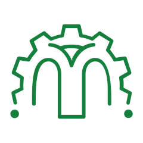
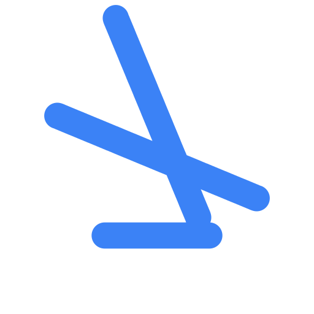
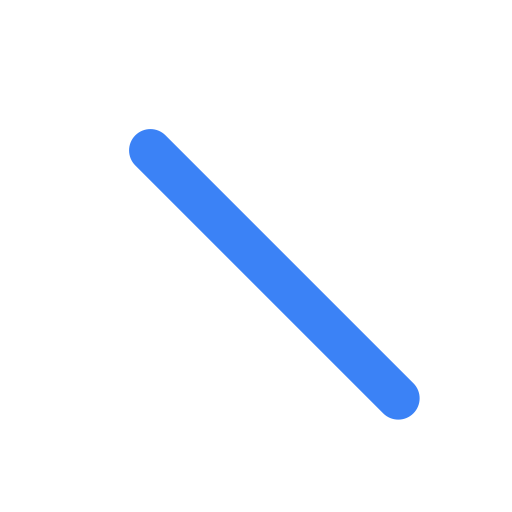

<p align="center">
  
</p>

<h1 align="center">MorpheusIcons</h1>

<p align="center">
  <strong>A physics-based icon morphing engine for Rust.</strong><br/>
  Fluid shape-shifting between any two stroke icons — from any icon library you want.
</p>

<p align="center">
  <a href="https://crates.io/crates/morpheusicons"></a>
  <a href="https://docs.rs/morpheusicons"></a>
  <a href="#license"></a>
</p>

<br/>

<p align="center">
  <picture>
    
  </picture>
  &nbsp;&nbsp;
  <picture>
    
  </picture>
  &nbsp;&nbsp;
  <picture>
    
  </picture>
  &nbsp;&nbsp;
  <picture>
    
  </picture>
  &nbsp;&nbsp;
  <picture>
    
  </picture>
</p>

<p align="center"><sub>Play → Pause · Menu → X · Sun → Moon · Check → X · Arrow → Down</sub></p>

---

## Why MorpheusIcons?

Most icon libraries give you static SVGs. MorpheusIcons gives icons **life** — transforming one into another with spring physics, Procrustes alignment, and polar interpolation. No manual keyframes. No frame-by-frame sprite sheets. Just math.

**And you bring your own icons.** Lucide, Heroicons, Tabler, Phosphor, or your hand-drawn SVGs — if it's stroke-based, it morphs.

---

## ✨ Highlights

| | |
|---|---|
| 🔌 **Any icon library** | Use Lucide, Heroicons, Tabler, Phosphor, or raw SVG paths. Implement one trait and you're in. |
| 🌀 **Procrustes alignment** | Automatic rotation & geometric alignment between shapes. No manual point mapping. |
| ⚡ **Spring physics** | Interruptible animations driven by a damped harmonic oscillator. Change target mid-animation with zero discontinuity. |
| 🎯 **Framework agnostic** | First-class integrations for GPUI, egui, Iced, Leptos, and Dioxus. Or just get an SVG `d="..."` string. |
| 📦 **Zero required deps** | Core engine is pure Rust — `std` only. Framework bindings are opt-in features. |
| 🌐 **WebAssembly ready** | Compile to WASM and morph icons in the browser. |

---

## 📦 Installation

```toml
[dependencies]
morpheusicons = "0.1"
```

### Feature Flags

| Feature | What you get |
|---------|-------------|
| `std` *(default)* | Standard library support |
| `catalog` *(default)* | Built-in icon set (60+ icons, Lucide-style) |
| `gpui` | GPUI integration (Zed editor framework) |
| `egui` | egui painter integration |
| `iced` | Iced SVG widget integration |
| `leptos` | Leptos reactive component |
| `dioxus` | Dioxus reactive component |
| `serde` | Serialize/deserialize paths & configs |
| `wasm` | WebAssembly bindings |

---

## 🚀 Quick Start

### The simplest morph

```rust
use morpheusicons::prelude::*;

let mut ctrl = MorphController::new(
    Icon::Play.path_data(),
    Icon::Pause.path_data(),
    SpringConfig::BOUNCY,
)?;

ctrl.morph_to_end();

// In your render loop:
loop {
    let still_animating = ctrl.update(0.016); // 60fps
    let svg_d = ctrl.current_svg_path();      // → "M6.00 4.00C..."
    render_svg(svg_d);
    if !still_animating { break; }
}
```

---

## 🔌 Bring Your Own Icons

MorpheusIcons is an **engine**, not a locked-in icon set. Use any stroke-based icon library:

### From raw path data (Lucide, Tabler, Feather…)

```rust
use morpheusicons::prelude::*;

// Paste the `d` attribute from any Lucide/Tabler/Heroicons SVG
let lucide_home = RawIcon::new("M3 9l9-7 9 7v11a2 2 0 0 1-2 2H5a2 2 0 0 1-2-2zM9 22V12h6v10");
let lucide_settings = RawIcon::new("M12 15a3 3 0 1 0 0-6 3 3 0 0 0 0 6z...");

let ctrl = MorphController::from_sources(
    &lucide_home,
    &lucide_settings,
    SpringConfig::GENTLE,
)?;
```

### From a full SVG string

Got a complete `<svg>` element? We'll extract and convert everything:

```rust
use morpheusicons::prelude::*;

let svg = r#"<svg viewBox="0 0 24 24" xmlns="http://www.w3.org/2000/svg">
  <circle cx="12" cy="12" r="10"/>
  <line x1="12" y1="8" x2="12" y2="16"/>
  <line x1="8" y1="12" x2="16" y2="12"/>
</svg>"#;

let icon = icon_from_svg(svg)?;  // Extracts & converts circle + lines → path data
let ctrl = MorphController::from_sources(&Icon::X, &icon, SpringConfig::BOUNCY)?;
```

### Implement `IconSource` for your own types

```rust
use morpheusicons::prelude::*;

/// Your wrapper around any external icon library
struct MyLucideIcon {
    d: &'static str,
}

impl IconSource for MyLucideIcon {
    fn path_data(&self) -> &str { self.d }
    fn viewport(&self) -> Viewport { Viewport::STANDARD_24 }
}

// Now it works with the entire MorpheusIcons API
let icon = MyLucideIcon { d: "M20 6L9 17l-5-5" };
let ctrl = MorphController::from_sources(&icon, &Icon::X, SpringConfig::DEFAULT)?;
```

### Different viewport sizes? No problem.

```rust
use morpheusicons::prelude::*;

// Phosphor icons use a 256×256 viewport
let phosphor_icon = RawIcon::with_viewport(
    "M128 24a104 104 0 1 0 104 104A104.11...",
    Viewport::new(256.0, 256.0),
);

// Viewport normalization happens automatically during morphing
let ctrl = MorphController::from_sources(
    &Icon::Sun,          // 24×24
    &phosphor_icon,      // 256×256 → scaled to match
    SpringConfig::BOUNCY,
)?;
```

---

## 🎯 Compatible Icon Libraries

| Library | Style | Viewport | Works? |
|---------|-------|----------|--------|
| [Lucide](https://lucide.dev) | Stroke | 24×24 | ✅ Perfect |
| [Feather](https://feathericons.com) | Stroke | 24×24 | ✅ Perfect |
| [Heroicons](https://heroicons.com) (outline) | Stroke | 24×24 | ✅ Perfect |
| [Tabler Icons](https://tabler.io/icons) | Stroke | 24×24 | ✅ Perfect |
| [Phosphor](https://phosphoricons.com) (regular/light/thin) | Stroke | 256×256 | ✅ Auto-scaled |
| Heroicons (solid) | Fill | 24×24 | ❌ Fill-based |
| Font Awesome | Fill | varies | ❌ Fill-based |

**Rule of thumb:** if the icon uses `stroke` and not `fill`, it will morph beautifully.

---

## 🧮 How It Works

```
┌──────────────┐     ┌──────────────┐
│  Icon A SVG  │     │  Icon B SVG  │
│  d="M5 12…"  │     │  d="M6 4…"   │
└──────┬───────┘     └──────┬───────┘
       │                     │
       ▼                     ▼
┌──────────────────────────────────┐
│  1. Parse SVG Path Commands      │
│     M, L, C, Q, A, H, V, S, Z   │
│     + convert arcs → cubics      │
└──────────────┬───────────────────┘
               │
               ▼
┌──────────────────────────────────┐
│  2. Arc-Length Resampling         │
│     N equidistant points per     │
│     subpath (default N = 64)     │
└──────────────┬───────────────────┘
               │
               ▼
┌──────────────────────────────────┐
│  3. Procrustes 2D Analysis       │
│     Optimal rotation θ via       │
│     cross-covariance H = AᵀB    │
└──────────────┬───────────────────┘
               │
               ▼
┌──────────────────────────────────┐
│  4. Polar Interpolation          │
│     p(t) = c(t) + R(θ(t))·v(t)  │
│     Organic rotation, no squish  │
└──────────────┬───────────────────┘
               │
               ▼
┌──────────────────────────────────┐
│  5. Spring Physics Driver        │
│     F = -k(x - target) - c·v    │
│     Interruptible at any point   │
└──────────────┬───────────────────┘
               │
               ▼
┌──────────────────────────────────┐
│  Output: SVG path d="..." or     │
│  DrawCommands or framework widget│
└──────────────────────────────────┘
```

---

## 🖼️ Framework Integrations

<details>
<summary><strong>GPUI (Zed editor)</strong></summary>

```rust
use gpui::*;
use morpheusicons::prelude::*;

struct AnimatedIcon {
    controller: MorphController,
}

impl Render for AnimatedIcon {
    fn render(&mut self, _window: &mut Window, _cx: &mut Context<Self>) -> impl IntoElement {
        MorpheusGpui::morph_svg(&self.controller)
            .size(px(24.0))
            .text_color(rgb(0x3b82f6))
    }
}
```

</details>

<details>
<summary><strong>egui</strong></summary>

```rust
use egui::{vec2, Color32};
use morpheusicons::integrations::egui::paint_morph_icon;

fn ui(ui: &mut egui::Ui, controller: &MorphController) {
    paint_morph_icon(ui, controller, vec2(24.0, 24.0), Color32::WHITE, 2.0);
}
```

</details>

<details>
<summary><strong>Iced</strong></summary>

```rust
use iced::widget::container;
use iced::{Element, Length};
use morpheusicons::integrations::iced::MorpheusIced;
use morpheusicons::prelude::*;

fn view(controller: &MorphController) -> Element<'_, Message> {
    let icon = MorpheusIced::morph_svg(controller)
        .width(Length::Fixed(32.0))
        .height(Length::Fixed(32.0));
    container(icon).into()
}
```

</details>

<details>
<summary><strong>Leptos</strong></summary>

```rust
use leptos::prelude::*;
use morpheusicons::integrations::leptos::MorphIcon;

#[component]
pub fn AnimatedToggle() -> impl IntoView {
    let (path_d, set_path_d) = signal(String::new());

    view! {
        <MorphIcon d=path_d class="w-6 h-6 text-blue-500" />
    }
}
```

</details>

<details>
<summary><strong>Dioxus</strong></summary>

```rust
use dioxus::prelude::*;
use morpheusicons::integrations::dioxus::MorphIcon;

fn app() -> Element {
    let path_d = use_signal(|| String::new());

    rsx! { MorphIcon { d: path_d, class: "w-6 h-6" } }
}
```

</details>

---

## 🔍 Validation & Compatibility Checking

Before morphing, you can check if icons are compatible:

```rust
use morpheusicons::prelude::*;
use morpheusicons::icons::validate::*;

// Quick syntax check
let result = check_path_data("M5 12h14M12 5l7 7-7 7");
assert!(result.is_ok()); // Returns Ok(subpath_count)

// Full compatibility report with quality score
let compat = check_morph_compatibility(
    "M4 6h16M4 12h16M4 18h16",  // menu
    "M18 6L6 18M6 6l12 12",      // x
    &Viewport::STANDARD_24,
);

assert!(compat.is_compatible);
println!("Quality: {:.0}%", compat.quality_score * 100.0);
// Quality: 90%
```

---

## ⚙️ Spring Configurations

| Preset | Feel | Use case |
|--------|------|----------|
| `SpringConfig::DEFAULT` | Smooth, no overshoot | General purpose |
| `SpringConfig::BOUNCY` | Playful overshoot | Toggles, micro-interactions |
| `SpringConfig::GENTLE` | Slow, elegant | Page transitions, ambient |

```rust
// Or define your own:
let custom = SpringConfig {
    stiffness: 200.0,
    damping: 15.0,
    mass: 1.0,
};
```

---

## 🧪 Running Examples

```bash
# CLI demo — watch morphing in terminal output
cargo run --example cli_morph

# GPUI native app
cargo run --example gpui_morph_demo --features gpui

# egui window
cargo run --example egui_morph_demo --features egui

# Iced app
cargo run --example iced_morph_demo --features iced

# WebAssembly demo (build static site in _site/)
make site
```

---

## 🏗️ Project Structure

```
src/
├── animation/
│   ├── morph.rs        # PathMorpher & MorphController
│   └── spring.rs       # Spring physics solver
├── geometry/
│   ├── path.rs         # SVG path parser (M/L/C/Q/A/H/V/S/T/Z)
│   ├── point.rs        # 2D point math
│   ├── procrustes.rs   # Procrustes alignment & polar interpolation
│   └── sampling.rs     # Arc-length equidistant resampling
├── icons/
│   ├── catalog.rs      # Built-in 60+ icon definitions
│   ├── pairs.rs        # Preset morph pairs (PlayPause, SunMoon…)
│   ├── source.rs       # IconSource trait & RawIcon
│   ├── svg_extract.rs  # Full SVG → path data extraction
│   └── validate.rs     # Compatibility checking & quality scoring
├── integrations/
│   ├── gpui.rs         # GPUI widget
│   ├── egui.rs         # egui painter
│   ├── iced.rs         # Iced SVG widget
│   ├── leptos.rs       # Leptos component
│   ├── dioxus.rs       # Dioxus component
│   └── svg.rs          # Pure SVG string renderer
├── lib.rs
└── wasm.rs             # WASM bindings
```

### Website

Every page of the showcase lives in `pages/` and is served at the site root.

```
pages/
├── index.html          # Morph studio (the WASM demo)
├── get-started.html    # Integration guide (npm, lucide.dev, Cargo)
└── llms.txt            # Machine-readable project summary
src/input.css           # Single source of hand-written CSS for every page
scripts/
└── sync-styles.mjs     # Regenerates each page's inline no-build <style> from src/input.css
dist/output.css         # Tailwind build output (generated)
_site/                  # Assembled static site (generated by `make site`)
```

`pages/` is flattened into `_site/` at build time, so page-relative links
(`./dist/output.css`, `./pkg/morpheusicons.js`, `llms.txt`) resolve identically
in development and in production. `make run-web` serves `pages/` at `/` and
falls through to the repository root for `dist/`, `pkg/`, and `assets/`.

| Command | What it does |
| --- | --- |
| `make site` | WASM + CSS + assemble `_site/` |
| `make assemble` | Re-assemble `_site/` only (no WASM/CSS rebuild) |
| `npm run build:css` | Sync inline styles, then build `dist/output.css` |
| `npm run sync:styles` | Regenerate the inline `<style>` blocks from `src/input.css` |

---

## 🤝 Contributing

Contributions are welcome! Whether it's a bug fix, new framework integration, or documentation improvement.

- 📖 Read the [Contributing Guide](CONTRIBUTING.md)
- 🐛 Found a bug? [Open an issue](https://github.com/paulo/morpheusicons/issues/new?template=bug_report.yml)
- ✨ Have an idea? [Request a feature](https://github.com/paulo/morpheusicons/issues/new?template=feature_request.yml)
- 💬 Questions? [Start a discussion](https://github.com/paulo/morpheusicons/discussions)

Please read our [Code of Conduct](CODE_OF_CONDUCT.md) before participating.

---

## 🔒 Security

Found a vulnerability? Please report it responsibly — see [SECURITY.md](SECURITY.md) for details.

---

## 📄 License

Dual-licensed under [MIT](LICENSE-MIT) or [Apache 2.0](LICENSE-APACHE) at your choice.

---

<p align="center">
  <sub>Inspired by <a href="https://github.com/guillermolg00/morphicons">morphicons</a> · Built with 🦀 and math</sub>
</p>
